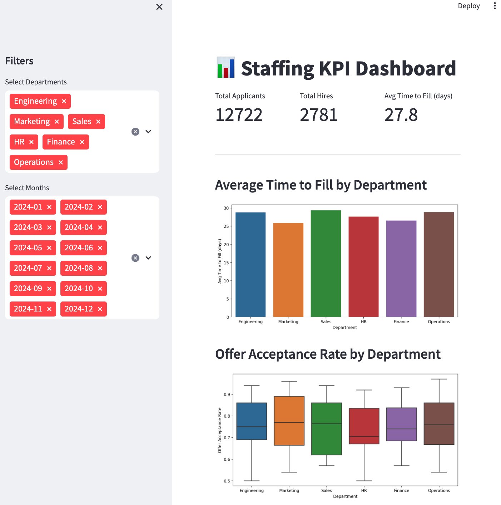

# 📊 Staffing KPI Dashboard

This project is a data-driven dashboard that simulates and visualizes recruiting performance across departments. Built with **Python** and **Streamlit**, it allows HR teams and hiring managers to explore key staffing metrics interactively.

---

## 🚀 Overview

The dashboard provides insight into simulated monthly recruiting data across six departments. It is designed to support decisions related to hiring pipeline efficiency and offer strategy.

---

## 📌 Key Features

- Filters for department and time period
- KPIs: Applicants, Hires, Average Time to Fill
- Visualizations:
  - Hiring funnel: Applicants → Interviews → Offers → Hires
  - Average Time to Fill by Department
  - Offer Acceptance Rate by Department
  - Time to Fill Trends Over Time

---

## 📁 Project Structure

```
staffing-kpi-dashboard/ 
├── staffing_data.csv # Simulated dataset 
├── generate_data.py # Script to generate the data 
├── dashboard.py # Streamlit app 
├── staffing_dashboard.ipynb # Notebook for EDA and visuals 
├── images/ 
│ └── dashboard_screenshot.png # Screenshot for portfolio/README 
└── README.md # This file 
```


---

## 🛠️ How to Run

1. Clone the repo or download the files  
2. Install required packages:

   ```bash
   pip install streamlit pandas matplotlib seaborn
   ```
   ```bash
   streamlit run dashboard.py
   ```



This project was built to demonstrate how data science can empower smarter hiring decisions. It reflects my experience in operations and recruiting, combined with my skills in data analysis and Python.
